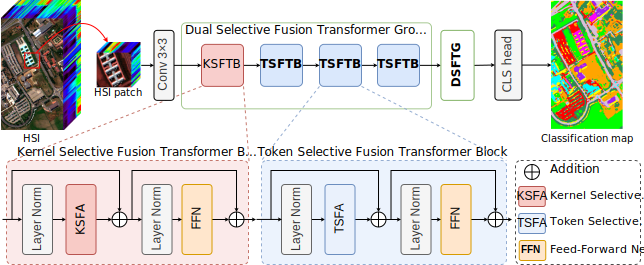

<h1 align="center">DSFormer</h1>

<h3>Dual Selective Fusion Transformer Network for Hyperspectral Image Classification
</h3>

[Yichu Xu](https://scholar.google.com/citations?user=CxKy4lEAAAAJ&hl=en&oi=ao)1,2, 
[Di Wang](https://scholar.google.com/citations?user=3fThjewAAAAJ&hl=en)1,2, 
[Lefei Zhang](https://scholar.google.com/citations?user=BLKHwNwAAAAJ&hl=en)1,2 *, 
[Liangpei Zhang](https://scholar.google.com/citations?user=vzj2hcYAAAAJ&hl=en)1,3 

 

1 Wuhan University, 2 Hubei Luojia Laboratory,  3 Henan Academy of Sciences,  * Corresponding author

    

