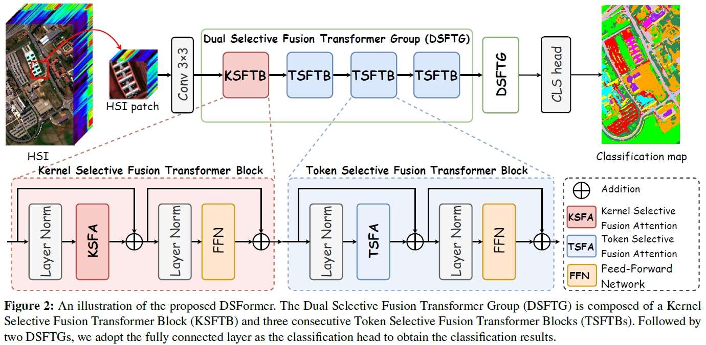

<div align="center">
<h1 align="center">DSFormer</h1>

<h3>Dual Selective Fusion Transformer Network for Hyperspectral Image Classification
</h3>

[Yichu Xu](https://scholar.google.com/citations?user=CxKy4lEAAAAJ&hl=en&oi=ao)<sup>1,2</sup>, 
[Di Wang](https://scholar.google.com/citations?user=3fThjewAAAAJ&hl=en)<sup>1,2</sup>, 
[Lefei Zhang](https://scholar.google.com/citations?user=BLKHwNwAAAAJ&hl=en)<sup>1,2 *</sup>, 
[Liangpei Zhang](https://scholar.google.com/citations?user=vzj2hcYAAAAJ&hl=en)<sup>1,3 </sup>

[](https://arxiv.org/abs/2410.03171) [](https://arxiv.org/abs/2410.03171)

<sup>1</sup> Wuhan University, <sup>2</sup> Hubei Luojia Laboratory,  <sup>3</sup> Henan Academy of Sciences,  <sup>*</sup> Corresponding author

</div>


## 📖Overview

* [**DSFormer**](https://arxiv.org/abs/2410.03171) is a novel Dual Selective Fusion
Transformer Network  for HSI classification. It adaptively selects and fuses features from diverse
receptive fields to achieve joint spatial-spectral context modeling, while reducing unnecessary information
interference by focusing on the most relevant spatial-spectral tokens.  

<div align="center">
  <br><br>
</div>

## 🚀Let's Get Started!
### `A. Installation`
**Step 1: Clone the repository:**

Clone this repository and navigate to the project directory:
```bash
git clone https://github.com/YichuXu/DSFormer.git
cd DSFormer
```

**Step 2: Environment Setup:**

It is recommended to set up a conda environment and installing dependencies via pip. Use the following commands to set up your environment:

***Create and activate a new conda environment***

```bash
conda create -n DSFormer
conda activate DSFormer
```

***Install dependencies***

Our method uses python 3.8, pytorch 1.13, other environments are in requirements.txt
```bash
pip install -r requirements.txt
```

### `B. Data Preparation`

Download HSI classification dataset from [Baidu Drive (百度网盘)](https://pan.baidu.com/s/1bSqq-Uv3AC5qfRmqxbMjfg?pwd=2025) and put it under the [dataset] folder. It will have the following structure: 
```
${DATASET_ROOT}   # Dataset root directory
├── datasets
│   │
│   ├── pu        # Pavia University data
│   │   ├──PaviaU.mat
│   │   ├──PaviaU_gt.mat
│   │
│   ├── houston13  # Houston 2013 data
│   │   ├──GRSS2013.mat
│   │   ├──GRSS2013_gt.mat 
│   │
│   ├── ip         # Indian Pines data	
│   │   ├──Indian_pines_corrected.mat
│   │   ├──Indian_pines_gt.mat 
│   │     
│   ├── whuhh     # Whu-HongHu data
│   │   ├──WHU_Hi_HongHu.mat
│   │   ├──WHU_Hi_HongHu_gt.mat 
│   │
│   ├── other HSI Datasets   
│   │   ├ ... 
│   │    

```

### `C. Performance Evaluation`
- The following commands show how to train and evaluate DSFormer for HSI classification:
```bash
python main.py --model DSFormer --dataset_name pu --num_run 10 --epoch 500 --device 0 --dataID 1 --patch_size 10 --k 2/5 --train_num 30 --group_num 4 --ps 2
python main.py --model DSFormer --dataset_name ip --num_run 10 --epoch 500 --device 1 --dataID 4 --patch_size 10 --k 4/5 --train_num 50 --group_num 4 --ps 2
python main.py --model DSFormer --dataset_name houston13 --num_run 10 --epoch 500 --device 2 --dataID 3 --patch_size 10 --k 3/5 --train_num 50 --group_num 4 --ps 2
python main.py --model DSFormer --dataset_name whuhh --num_run 10 --epoch 500 --device 3 --dataID 7 --patch_size 10 --k 3/5 --train_num 50 --group_num 4 --ps 2
```

## 📜Reference

if you find it useful for your research, please consider giving this repo a ⭐ and citing our paper! We appreciate your support！😊
```
@ARTICLE{Xu2025DSFormer,
  author={Xu, Yichu and Wang, Di and Zhang, Lefei and Zhang, Liangpei},
  title={Dual Selective Fusion Transformer Network for Hyperspectral Image Classification}, 
  journal={Neural Networks},
  volume={},
  pages={1-15},
  year={2025},
}
```

## 🙋Q & A
**For any questions, please [contact us.](mailto:xuyichu@whu.edu.cn)**


## 💖 Thanks
This project is based on [GSC-ViT](https://github.com/flyzzie/TGRS-GSC-VIT), [TTST](https://github.com/XY-boy/TTST),
[LSKNet](https://github.com/zcablii/LSKNet), [ObjFormer](https://github.com/ChenHongruixuan/ObjFormer). Thanks for their great work!<br>
